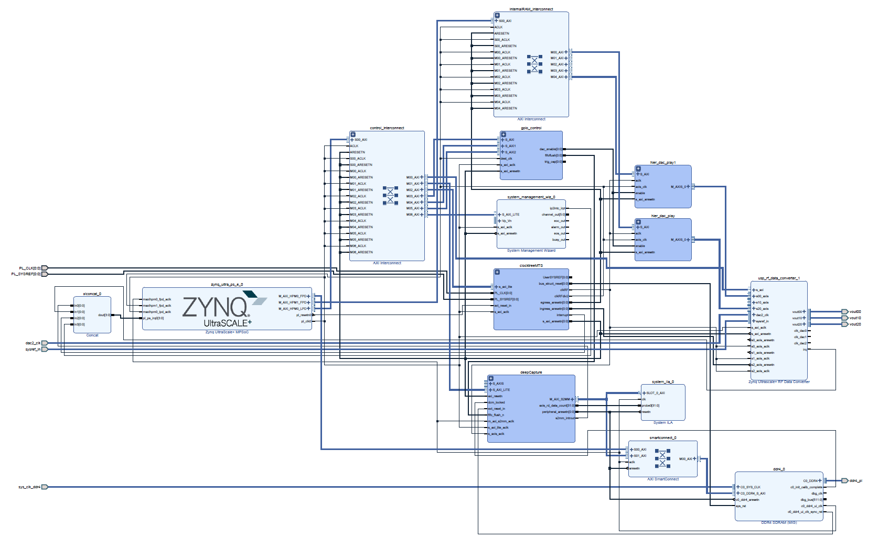

# RFSOC-PYNQ Arbitrary Waveform Generation Overlay
This repository hosts an RFSoC overlay compatible with [PYNQ image v3.0.1](https://github.com/Xilinx/PYNQ/releases). This overlay demonstrates 8GS AWG capabilities by using two seperate DAC tiles with individual 1MB deep memory to allow for waveform shaping up to 8GHz. 


**PLEASE NOTE:** This overlay is a heavily modified version of the RFSoC-MTS overlay, with the MTS functionality stripped in favour of increasing the capability of the RFSoC to act as an AWG. As such there are some defunct blocks in the stable overlay (e.g. the deepCapture and DDR4 are not usable). Additionally some file naming still reflects MTS. **This overlay was made as part of an undergraduate student project and will likely not be maintained or updated in future! Multiple good practises are broken making it difficult to update or edit**


The block diagram below shows an overview of the stable version of this overlay. A waveform is generated in PYNQ and formatted as a numpy array before being loaded into 1 of the 2 DAC tiles. 
The primary DAC is set up to optimise the power of the signal in the first Nyquist zone. The second DAC was set up to optimise the power of the aliased signal in the second Nyquist zone.  



## Board Support
This design is available for the following boards:
* RFSoC4x2

## Quick Start
Follow the instructions below to install the "mts-awg" overlay. **You will need to give your board access to the internet**.
* Power on your RFSoC development board with an SD Card containing a fresh PYNQ v3.x image.
* You will need to know the IPv4 address of your board which you can find via the USB virtual COM port connection.  Refer to <a href="https://pynq.readthedocs.io/en/v2.6.1/getting_started/terminal.html">"finding your board's IP address"</a>
* Navigate to Jupyter Labs by opening a browser and connecting to `http://<board_ip_address>:9090/lab`.
* Open a terminal in Jupyter as illustrated below:
<p align="center">
  
</p>

Run the code below in the Jupyter terminal to install the RFSoC-MTS-AWG project files.

```sh
git clone https://github.com/tave0002/RFSoC-MTS-AWG.git
cd RFSoC-MTS-AWG
./install.sh
```

Once installation has finished you will find a *RFSoC-MTS-AWG* folder in the Jupyter workspace directory (left-sidebar). 

Open the **rfsocMTS** notebook within the boards/RFSoC4x2 folder and begin running each cell in order.  If after attempting to load the overlay an AssertionError is thrown reporting, "Could not restart zocl. Please restart Shutdown All Kernels and restart" as shown in the figure below. 

<p align="center">
  
</p>

You may have other notebooks currently open.  Because this design uses a device tree overlay to access PL-DRAM, you will need to shutdown all other kernels before starting this one.  To do this, click on the Kernel menu and then choose "Shut Down All Kernels" as shown in the figure.

<p align="center">
  
</p>

The notebook loads a DAC memory with a user definable waveform.  A frequency comb is used in this example and broadcast out of DAC_A. Users can edit the cell by uncommenting lines to additionally play the waveform from DAC_B, which will optimise the power in the second nyquist zone. 

Users may re-run the notebook with different waveform properties and adjust the waveform plots. Once AWG is enabled it will stay active until the overlay is reloaded or notebook re-run.


The DDR4 testing notebook shows the indended use of the development overlay. It loads a waveform of 2MB (although the overlay can be recompiled to use up to 4GB) into DDR4 and attempts to play it from DAC_A (tile 230). Currently however this overelay is non-functional, and while a waveform can be uploaded to DDR4 the resulting waveform is not what is loaded into DDR4 expect in very spesific circumstances. 

## Rebuilding the MTS Overlay
To rebuild the provided bitstreams Vivado 2022.1 is required.

### Vivado

Two Vivado board projects are provided called "mtsStable" and "mtsDev.  It is located under *boards/RFSoC4x2* directories as *build_mts*. A makefile is provided to build the overlays. Running *make all* will start the Vivado build for the mtsStable overlay and when finished the **bit** and **hwh** products will remain in the directory.  For example one may do the following:
```sh
cd /<repository-location>/boards/<board_name>/build_mts
```
Once in that directory you may run 'make all' and it will build a bitream and hardware description file.
```sh
make all
```
#### Further Overlay Customization or Inspection
For inspection or customization of the overlay, one may choose to start Vivado and without opening a project, issue the following via the tcl console (located at the bottom on the screen in Vivado):
```sh
source mtsStable.tcl
```
or for the development version
```sh
source mtsDev.tcl
```
This will create the **mts** project for the chosen board and build the block diagram.  This allows the user to further customize the design as per their needs or just inspect within the GUI.  To continue the build process, additional tcl scripts can be run from the console such as: *build_bitstream.tcl* and *check_timing.tcl*, or the user may provide their own.

Alternativly, you can simply use the build bitstream button in Vivado

## License 
[MIT](./LICENSE)
